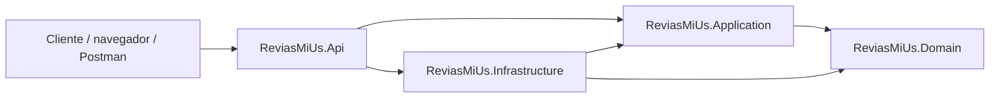

# Arquitectura Interna Actual

> Nota: este documento conserva el primer diseno de la arquitectura. La documentacion vigente y completa se encuentra en [`../docs/README.md`](../docs/README.md), especialmente [`../docs/01-ARQUITECTURA.md`](../docs/01-ARQUITECTURA.md) y [`../docs/11-CODE-MAP.md`](../docs/11-CODE-MAP.md).

Este documento describe cómo está quedando el sistema en su estado actual.

## Visión general

El sistema está organizado con una arquitectura hexagonal por capas:

- `API` como entrada HTTP
- `Application` como orquestador de casos de uso
- `Domain` como centro de reglas de negocio
- `Infrastructure` como adaptadores de persistencia

La idea principal es que la lógica de negocio no dependa de detalles técnicos como HTTP, memoria, base de datos o frameworks.

## Flujo de dependencias

```text
API -> Application -> Domain
API -> Infrastructure -> Domain
Application -> Domain
Infrastructure -> Application + Domain
```

Las dependencias van hacia adentro.

## Diagrama lógico



## Capa por capa

### 1. `ReviasMiUs.Api`

Punto de entrada del sistema.

Responsabilidades:

- levantar la aplicación ASP.NET Core
- registrar dependencias en DI
- inicializar el seed en memoria
- exponer endpoints HTTP
- devolver respuestas JSON

Archivo principal:

- [`Program.cs`](./ReviasMiUs.Api/Program.cs)

Endpoints actuales:

- `GET /`
- `GET /api/crm/leads`
- `GET /api/crm/leads/search?term=...`
- `POST /api/crm/leads`
- `PATCH /api/crm/leads/{id}/stage`
- `GET /api/crm/dashboard`
- `GET /api/customers`
- `GET /api/customers/search?term=...`
- `POST /api/customers`
- `GET /api/products`
- `GET /api/products/low-stock`
- `POST /api/products`
- `GET /api/sales-orders`
- `GET /api/sales-orders/{id}`
- `POST /api/sales-orders`
- `POST /api/sales-orders/{id}/confirm`
- `POST /api/sales-orders/{id}/cancel`
- `GET /api/dashboard`
- `GET /api/restaurant/tables`
- `POST /api/restaurant/tables/{number}/release`
- `GET /api/cash-shifts`
- `POST /api/cash-shifts/open`
- `POST /api/cash-shifts/{id}/movements`
- `POST /api/cash-shifts/{id}/close`
- `GET /api/kitchen/tickets`
- `POST /api/kitchen/tickets/{id}/advance`
- `GET /api/billing/documents`
- `POST /api/pos/checkout`

### 2. `ReviasMiUs.Application`

Capa de aplicación.

Responsabilidades:

- coordinar reglas de negocio
- aplicar validaciones de caso de uso
- transformar entidades a DTOs
- usar LINQ para consultas y proyecciones
- depender solo de abstracciones, no de la persistencia concreta

Componentes:

- `Abstractions`
  - `ICustomerRepository`
  - `ILeadRepository`
  - `IProductRepository`
  - `ISalesOrderRepository`
  - `IUserAccountRepository`
  - `IOperationsRepository`
- `Services`
  - `CrmService`
  - `CustomerService`
  - `ProductService`
  - `SalesOrderService`
  - `DashboardService`
  - `UserAccountService`
  - `RestaurantOperationsService`
- `Dtos`
  - contratos de entrada y salida

### 3. `ReviasMiUs.Domain`

Capa central del negocio.

Responsabilidades:

- representar entidades reales del ERP
- encapsular reglas de negocio
- evitar estados inválidos
- lanzar excepciones de dominio cuando una regla falla

Entidades actuales:

- `Lead`
- `Customer`
- `Product`
- `SalesOrder`
- `OrderLine`
- `UserAccount`
- `RestaurantTable`
- `CashShift`
- `KitchenTicket`
- `FiscalDocument`

Base compartida:

- `Entity`
- `DomainException`

### 4. `ReviasMiUs.Infrastructure`

Capa de infraestructura.

Responsabilidades:

- implementar repositorios concretos
- guardar datos en memoria por ahora
- preparar semillas iniciales

Componentes:

- `InMemoryErpStore`
- `InMemoryLeadRepository`
- `InMemoryCustomerRepository`
- `InMemoryProductRepository`
- `InMemorySalesOrderRepository`
- `InMemoryUserAccountRepository`
- `InMemoryOperationsRepository`
- `SeedData`

## Módulos funcionales

### CRM

Permite:

- crear leads
- listarlos
- buscarlos por nombre, empresa o correo
- moverlos entre etapas
- medir el embudo comercial

### Clientes

Permite:

- crear clientes
- listarlos
- buscarlos por nombre o correo

### Catálogo

Permite:

- crear productos
- listarlos
- detectar bajo stock

### Órdenes de venta

Permite:

- crear cotizaciones en borrador con vigencia y notas
- filtrar documentos por estado o cliente mediante LINQ
- validar cliente
- consultar el detalle de una cotización o pedido
- confirmar una cotización y validar stock
- consolidar líneas repetidas con LINQ
- descontar inventario al confirmar
- cancelar y devolver inventario cuando corresponda

### Dashboard

Permite:

- contar clientes
- contar productos
- contar productos con stock bajo
- contar órdenes confirmadas
- sumar valor total de ventas confirmadas

### Operacion de restaurante

Permite:

- abrir y cerrar turnos por usuario y terminal
- controlar efectivo inicial, esperado, contado y diferencias
- administrar mesas libres, ocupadas y en limpieza
- registrar pagos en efectivo, tarjeta, Yape, Plin o transferencia
- enviar comandas y avanzar su estado en cocina
- emitir correlativos internos de boleta y factura
- ejecutar todo el checkout mediante un caso de uso coordinado

## Reglas importantes ya implementadas

- no se permite crear cliente sin nombre o email
- no se permite crear producto sin SKU, precio válido o stock válido
- no se permite ordenar productos inexistentes
- no se permite confirmar una orden sin líneas
- no se permite vender más stock del disponible
- las órdenes solo se editan cuando están en borrador
- una cotización vencida no se puede confirmar
- cancelar un pedido confirmado repone el stock

## Uso de LINQ

LINQ se usa en varios puntos para mantener la lógica compacta:

- ordenar clientes y productos
- filtrar clientes por texto
- detectar productos con bajo stock
- consolidar líneas de orden por `ProductId`
- calcular totales
- armar dashboards

## Persistencia actual

Todavía no hay base de datos real.

Ahora mismo el sistema usa memoria:

- los clientes viven en `List<Customer>`
- los productos viven en `List<Product>`
- las órdenes viven en `List<SalesOrder>`

Eso permite probar la arquitectura sin depender de SQL Server ni de paquetes externos.

## Seed inicial

Al arrancar la API se cargan datos de ejemplo:

- 3 clientes
- 4 productos

Esto está en:

- [`SeedData.cs`](./ReviasMiUs.Infrastructure/Persistence/SeedData.cs)

## Que falta todavia

- persistencia real con PostgreSQL y Entity Framework Core
- persistencia durable de sesiones y auditoria de seguridad
- integracion legal con SUNAT mediante un adaptador externo
- recetas, ingredientes, mermas y compras a proveedores
- reservas, delivery integrado y auditoria avanzada

## Estado actual del sistema

El sistema ya está listo como base técnica para crecer.

Lo importante es que:

- la API no contiene lógica de negocio pesada
- el dominio no conoce detalles de infraestructura
- la aplicación actúa como intermediaria
- la infraestructura puede cambiarse más adelante sin reescribir el centro del negocio
- las reglas críticas del flujo comercial tienen pruebas automatizadas
