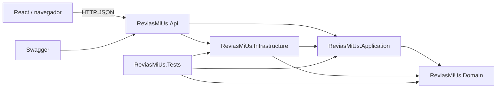
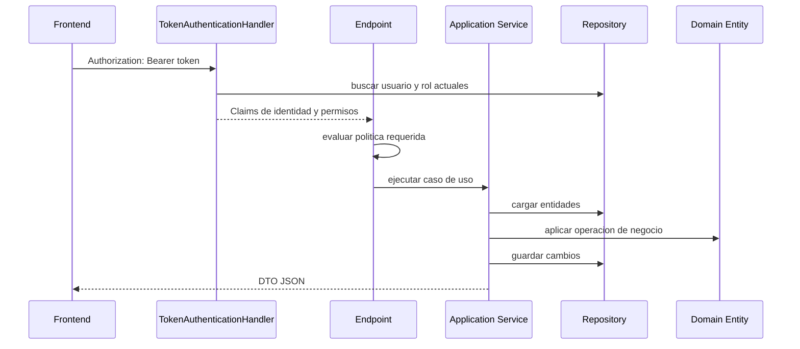

# Arquitectura

## Objetivo

ReviasMiUs separa las reglas de negocio de HTTP, React y la persistencia. La implementacion sigue una arquitectura hexagonal simplificada: el dominio ocupa el centro, Application define casos de uso y puertos, Infrastructure implementa adaptadores y API expone entradas HTTP.

## Diagrama general



## Regla de dependencias

```text
Api ------------> Application ------------> Domain
 |                     ^
 `--> Infrastructure --'
          |
          `-------------------------------> Domain
```

- `Domain` no referencia otros proyectos.
- `Application` solo referencia `Domain`.
- `Infrastructure` referencia `Application` y `Domain` para implementar los puertos.
- `Api` referencia `Application` e `Infrastructure` y compone el sistema.
- `Tests` referencia las tres capas internas.

## Capas

### Domain

Contiene entidades, enums, invariantes y `DomainException`. Las entidades controlan sus cambios mediante metodos y setters privados. Ejemplos: `SalesOrder.Confirm`, `CashShift.Close` y `FiscalDocument.Cancel`.

### Application

Contiene:

- casos de uso en `Services/`;
- contratos HTTP independientes en `Dtos/`;
- puertos de persistencia en `Abstractions/`;
- catalogo de permisos en `Security/Permissions.cs`.

Los servicios coordinan repositorios y entidades, realizan consultas LINQ y transforman entidades a DTOs.

### Infrastructure

Implementa los puertos de Application:

- repositorios en memoria;
- almacenamiento central `InMemoryErpStore`;
- hash de contrasenas PBKDF2;
- tokens opacos en memoria;
- datos iniciales en `SeedData`.

Cambiar a PostgreSQL debe consistir principalmente en reemplazar estos adaptadores sin reescribir Domain.

### API

`Program.cs` actua como composition root:

- configura DI, CORS, Swagger, autenticacion y autorizacion;
- ejecuta el seed;
- transforma rutas HTTP en llamadas a servicios;
- convierte `DomainException` en HTTP 400;
- aplica permisos mediante politicas.

`TokenAuthenticationHandler` valida el bearer token y construye el principal con claims de identidad, rol y permisos vigentes.

### Frontend

React consume exclusivamente la API. El access token vive en memoria; el refresh token permanece en cookie HttpOnly. La navegacion y las acciones visibles se derivan de `currentUser.permissions`, pero la API siempre vuelve a validar el permiso.

## Puertos y adaptadores

| Puerto de Application | Adaptador actual |
|---|---|
| `ICustomerRepository` | `InMemoryCustomerRepository` |
| `ILeadRepository` | `InMemoryLeadRepository` |
| `IProductRepository` | `InMemoryProductRepository` |
| `ISalesOrderRepository` | `InMemorySalesOrderRepository` |
| `IUserAccountRepository` | `InMemoryUserAccountRepository` |
| `IRoleRepository` | `InMemoryRoleRepository` |
| `IOperationsRepository` | `InMemoryOperationsRepository` |
| `ISystemSettingsRepository` | `InMemorySystemSettingsRepository` |
| `IPasswordHasher` | `Pbkdf2PasswordHasher` |
| `ITokenService` | `InMemoryTokenService` |

## Flujo de una solicitud protegida



## Decisiones actuales

- Minimal APIs reducen infraestructura HTTP para el prototipo.
- Repositorios en memoria permiten validar el dominio sin preparar una base de datos.
- Tokens opacos evitan incluir informacion sensible en el token del cliente.
- Los permisos se resuelven por solicitud para reflejar cambios de rol inmediatamente.
- Los permisos administrativos son reservados y no pueden asignarse a roles personalizados.

## Limites arquitectonicos actuales

- No existe unidad de trabajo ni transaccion atomica para el checkout.
- La persistencia y los tokens se pierden al reiniciar la API.
- `Program.cs` concentra todos los endpoints; al crecer conviene separarlos por modulos.
- Los mensajes de dominio estan mayormente en ingles mientras la interfaz esta en espanol.
- No hay bus de eventos, auditoria ni observabilidad estructurada.
