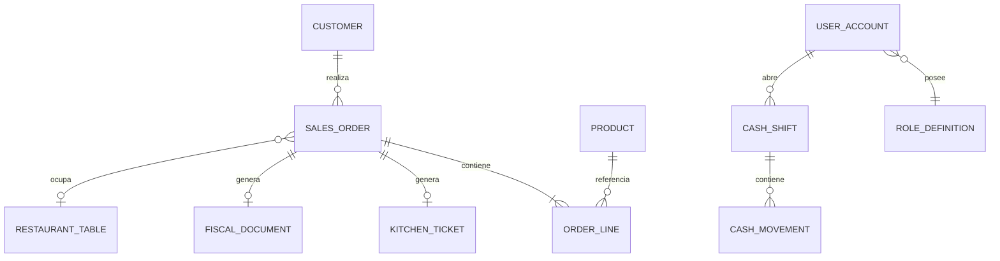
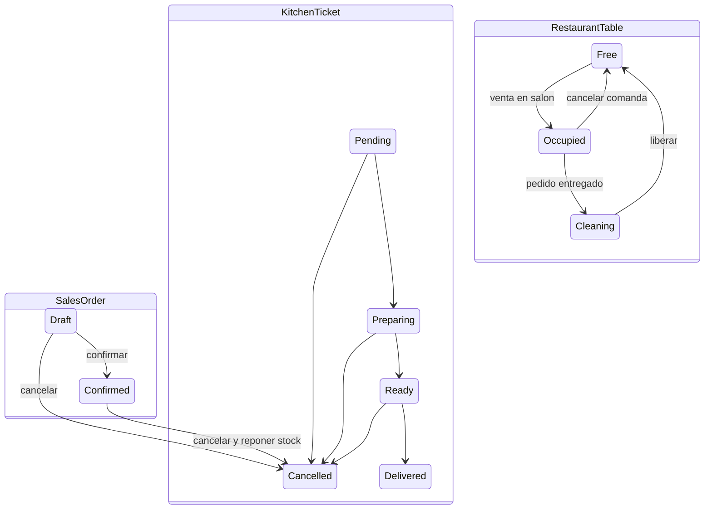

# Modelo de dominio

## Base compartida

Todas las entidades heredan de `Entity`, que entrega un identificador `Guid`. Las reglas invalidas lanzan `DomainException`; el middleware de API las presenta como HTTP 400.

## Relaciones principales



Las relaciones actuales se guardan como identificadores y se resuelven en servicios; no hay ORM ni propiedades de navegacion.

## Entidades

### Customer

Representa un cliente comercial.

- Campos: `Id`, `Name`, `Email`, `IsActive`, `CreatedAtUtc`.
- Valida nombre y correo con `@`.
- Puede actualizar perfil, activarse o desactivarse.
- Si tiene pedidos relacionados no se elimina; el servicio exige desactivarlo.

### Lead

Representa una oportunidad CRM.

- Campos: nombre, empresa, email, telefono, fuente, score, etapa y fecha.
- Etapas: `New`, `Qualified`, `Proposal`, `Won`, `Lost`.
- Score valido entre 0 y 100.
- Permite actualizar datos y mover etapa.

### Product

Representa un producto o plato vendible.

- Campos: nombre, SKU, precio unitario, stock, punto de reposicion, categoria y estado.
- `NeedsReorder` se calcula comparando stock con punto de reposicion.
- `DecreaseStock` impide vender mas que lo disponible.
- `IncreaseStock` repone inventario al cancelar una venta confirmada.
- Productos usados por pedidos se desactivan en vez de eliminarse.

### OrderLine

Linea inmutable conceptualmente dentro de una orden.

- Guarda `ProductId`, `ProductName`, cantidad y precio unitario.
- Calcula `LineTotal = Quantity * UnitPrice`.
- Valida cantidad positiva, producto valido y precio no negativo.

### SalesOrder

Representa cotizacion o pedido.

- Estados: `Draft`, `Confirmed`, `Cancelled`.
- Modalidad: `Retail`, `DineIn`, `Takeaway`, `Delivery`.
- Contiene lineas y calcula total con LINQ.
- Solo un borrador puede editarse o eliminarse.
- Una cotizacion vencida no puede confirmarse.
- Confirmar cambia estado y el servicio descuenta stock.
- Cancelar una orden confirmada permite al servicio reponer stock.

### UserAccount

Cuenta autenticable.

- Campos: nombre, email, codigo de rol, estado, fecha y hash de contrasena.
- No almacena contrasena en texto plano.
- El rol es un codigo dinamico, no un enum cerrado.
- Un usuario con turno abierto no puede desactivarse.
- Un usuario con historial de caja no puede eliminarse.
- El ultimo administrador activo esta protegido.

### RoleDefinition

Define autorizacion reutilizable.

- Campos: codigo estable, nombre, descripcion, indicador de sistema y permisos.
- El codigo acepta 3 a 40 letras, numeros, guion o guion bajo.
- Evita permisos duplicados con `HashSet` sin distincion de mayusculas.
- El Administrador no puede editarse.
- Roles del sistema no pueden eliminarse.
- Roles asignados tampoco pueden eliminarse.

### RestaurantTable

Representa una mesa fisica.

- Estados: `Free`, `Reserved`, `Occupied`, `Cleaning`.
- Solo mesas libres pueden editarse o eliminarse.
- `Occupy` vincula pedido y hora.
- Al entregar cocina pasa de ocupada a limpieza.
- `Release` vuelve a libre y borra la vinculacion.

### CashShift

Turno de caja perteneciente a un usuario.

- Estados: `Open`, `Closed`.
- Guarda efectivo inicial, movimientos, conteo final y fechas.
- Medios: efectivo, tarjeta, Yape, Plin y transferencia.
- `GrossSales` suma pagos de cualquier medio.
- `ExpectedCash` considera saldo inicial y solo movimientos de efectivo.
- `Difference = CountedCash - ExpectedCash`.
- Solo un turno abierto acepta pagos o movimientos.

### CashMovement

Registro de caja.

- Tipos: `Payment`, `CashIn`, `CashOut`.
- Puede asociarse a una orden.
- Entradas y salidas manuales siempre usan efectivo y requieren motivo.

### KitchenTicket

Comanda de cocina.

- Estados: `Pending`, `Preparing`, `Ready`, `Delivered`, `Cancelled`.
- Avanza en orden y registra inicio/listo.
- Entregar una comanda de salon envia la mesa a limpieza.
- No puede cancelarse si ya fue entregada o cancelada.

### FiscalDocument

Boleta o factura interna.

- Tipos: `Receipt`, `Invoice`.
- Estados definidos: `Issued`, `Accepted`, `Rejected`, `Cancelled`.
- El flujo actual crea documentos en `Issued`; Accepted/Rejected quedan para SUNAT.
- Factura exige RUC de longitud 11.
- Calcula base e impuesto desde un total que ya incluye impuesto.
- Anular conserva documento y correlativo.

Formula:

```text
TaxableAmount = round(TotalAmount / (1 + TaxRate / 100), 2)
TaxAmount     = TotalAmount - TaxableAmount
```

### SystemSettings

Configuracion global.

- Nombre comercial y RUC emisor.
- Moneda y tasa de impuesto.
- Zona horaria.
- Series de boleta y factura.
- Requisito de mesa para consumo en salon.

Actualmente la configuracion vive en memoria y se restablece al reiniciar.

## Estados de los agregados


