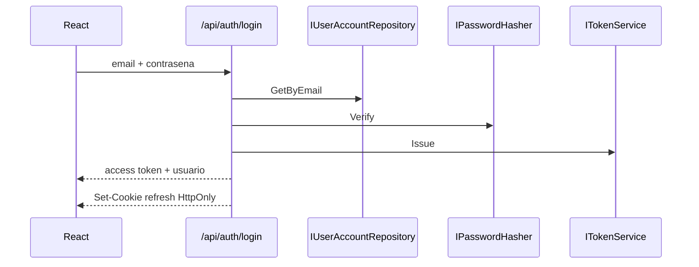

# Seguridad, usuarios y permisos

## Modelo de autenticacion

El sistema usa dos tokens opacos aleatorios:

- access token: 48 bytes aleatorios, vigencia de 15 minutos;
- refresh token: 48 bytes aleatorios, vigencia de 7 dias.

El cliente no puede decodificarlos. El servidor guarda solamente SHA-256 del token, no el valor original.

## Inicio de sesion

El login devuelve 401 tanto para email inexistente como para contrasena incorrecta.

## Contrasenas

`Pbkdf2PasswordHasher` usa:

- PBKDF2;
- SHA-256;
- 120,000 iteraciones;
- salt aleatorio;
- comparacion en tiempo constante.

El formato almacenado incluye version/parametros, salt y hash. Las contrasenas nunca regresan en DTOs.

## Sesion del frontend

- Access token: variable en memoria de `api.ts`.
- Refresh token: cookie `revias_refresh`, `HttpOnly`, `SameSite=Strict`, ruta `/api/auth`.
- `Secure=false` solamente porque el entorno actual usa HTTP local.
- Al abrir la aplicacion, `restoreSession` intenta rotar el refresh token.
- Ante HTTP 401 en una llamada protegida, el cliente intenta una renovacion y repite una vez.
- `refreshPromise` evita rotaciones concurrentes.
- Logout revoca ambos tokens y elimina la cookie.

## Autenticacion en cada peticion

`TokenAuthenticationHandler`:

1. extrae `Authorization: Bearer`;
2. valida el access token;
3. carga usuario y rol actuales;
4. rechaza usuario inactivo o rol inexistente;
5. crea claims de identificador, nombre, email y rol;
6. agrega un claim `permission` por cada permiso vigente.

Consultar usuario/rol en cada peticion hace que bloquear una cuenta o cambiar un rol tenga efecto inmediato sobre tokens ya emitidos.

## Permisos

| Codigo | Funcion | Solo Administrator |
|---|---|---|
| `dashboard.view` | Ver panel general | No |
| `products.view` | Consultar catalogo/precios/stock | No |
| `products.manage` | Crear, editar, eliminar y cambiar precios | Si |
| `customers.view` | Consultar clientes | No |
| `customers.manage` | Crear y editar clientes | No |
| `customers.delete` | Eliminar clientes | Si |
| `crm.manage` | Gestionar oportunidades | No |
| `sales.manage` | Gestionar cotizaciones/pedidos | No |
| `pos.use` | Completar ventas POS | No |
| `tables.view` | Consultar mesas | No |
| `tables.manage` | Crear, editar y eliminar mesas | Si |
| `tables.release` | Liberar mesas | No |
| `cash-shifts.manage` | Operar turno propio | No |
| `kitchen.manage` | Gestionar comandas | No |
| `billing.view` | Consultar comprobantes | No |
| `billing.cancel` | Anular comprobantes | Si |
| `users.manage` | Administrar cuentas | Si |
| `roles.manage` | Administrar roles | Si |
| `settings.manage` | Cambiar ajustes | Si |

## Roles iniciales

### Administrator

Todos los 19 permisos. Es inmutable y no puede eliminarse.

### Cashier

`dashboard.view`, `products.view`, `customers.view`, `customers.manage`, `pos.use`, `tables.view`, `tables.release`, `cash-shifts.manage`, `kitchen.manage`, `billing.view`.

### Sales

`dashboard.view`, `products.view`, `customers.view`, `customers.manage`, `crm.manage`, `sales.manage`.

### Warehouse

`dashboard.view`, `products.view`, `tables.view`, `kitchen.manage`.

## Roles personalizados

Al crear/editar un rol:

- permisos desconocidos producen error;
- permisos reservados producen error;
- `dashboard.view` se agrega siempre;
- `customers.manage` agrega `customers.view`;
- `tables.release` agrega `tables.view`;
- `pos.use` agrega productos, clientes, mesas, caja y comprobantes de lectura;
- `sales.manage` agrega productos y clientes de lectura.

Un rol personalizado solo se elimina si no tiene usuarios. Los roles de sistema no se eliminan.

## Protecciones de objeto

La politica no siempre es suficiente. Caja agrega una validacion por recurso:

- Administrator puede operar cualquier turno;
- otro usuario solo puede agregar movimientos o cerrar un turno cuyo `UserId` coincide con su identidad.

La API sustituye el `UserId` recibido en apertura/checkout por el identificador del token para evitar suplantacion.

La edicion del diseño del ticket requiere `settings.manage`. Los usuarios con `billing.view` solo reciben la plantilla de lectura y pueden imprimir o reimprimir; no pueden cambiar logo, textos ni elementos visibles.

## Seguridad de pedidos QR

- cada mesa usa un token aleatorio de 128 bits y no su numero visible;
- el administrador puede renovar el token para invalidar copias anteriores;
- la API publica solo entrega carta, disponibilidad y datos basicos de la mesa;
- no permite consultar otros pedidos, cobrar, facturar ni modificar precios;
- valida cantidades y longitudes tanto en backend como en frontend;
- aplica un limite de 20 solicitudes por minuto al grupo publico;
- los productos se vuelven a validar al confirmar y el stock se descuenta en el servidor.

Para produccion se recomienda complementar el limite global con particion por IP, CAPTCHA adaptativo ante abuso y auditoria persistente de pedidos QR.

## Claves de desarrollo

Data Protection persiste claves locales en `ReviasMiUs.Api/.keys/`. El directorio esta ignorado por Git. En produccion debe usarse un almacen protegido y compartido si existen varias instancias.

## Requisitos para produccion

- HTTPS obligatorio y cookie `Secure=true`;
- secretos y credenciales fuera del repositorio;
- usuarios, roles, tokens revocados y auditoria persistentes;
- politica de contrasenas y recuperacion segura;
- rate limiting para login/refresh;
- bloqueo temporal ante intentos fallidos;
- rotacion de claves;
- logs de auditoria sin datos sensibles;
- CORS restringido al dominio real;
- proteccion CSRF evaluada para endpoints basados en cookie;
- pruebas de autorizacion por endpoint.
