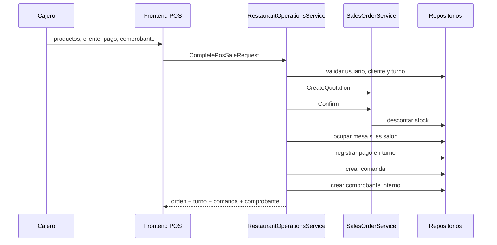

# Flujos de negocio

## 1. Inicio de jornada

1. El empleado inicia sesion.
2. La API resuelve rol y permisos vigentes.
3. Si posee `pos.use`, entra al POS.
4. Si no tiene turno abierto, indica efectivo inicial.
5. La API crea un `CashShift` asociado al usuario autenticado.

Solo puede existir un turno abierto por usuario.

## 2. Venta POS completa



Precondiciones:

- usuario activo con permiso POS;
- turno abierto propio;
- cliente existente;
- al menos una linea valida;
- stock suficiente;
- mesa libre para `DineIn`;
- RUC de longitud 11 para factura.

Resultado:

- orden confirmada;
- inventario reducido;
- movimiento de pago;
- mesa ocupada si aplica;
- comanda pendiente;
- documento fiscal interno emitido.

Importante: actualmente no hay transaccion atomica. Una base de datos debe ejecutar este flujo en una transaccion.

## 3. Modalidades

### Salon (`DineIn`)

Requiere mesa existente y libre. La mesa queda ocupada con el `OrderId`.

### Para llevar (`Takeaway`)

No ocupa mesa; si genera comanda y comprobante.

### Delivery (`Delivery`)

No ocupa mesa. Todavia no guarda direccion, repartidor ni tracking.

### Mostrador (`Retail`)

Disponible en pedidos comerciales; el selector POS usa las otras tres modalidades.

## 4. Cocina y mesas

### Pedido del comensal mediante QR

1. Administrador abre `Mesas y caja`, selecciona `QR` y descarga o imprime la tarjeta.
2. El comensal escanea el codigo y abre `/?table={token}` sin iniciar sesion.
3. La carta muestra solo productos activos y disponibles.
4. El comensal selecciona cantidades, escribe nombre y observaciones y envia.
5. Backend valida nuevamente token, limites, productos y stock.
6. Se confirma una orden de salon, se descuenta inventario y se ocupa la mesa si estaba libre.
7. Cocina recibe una comanda con mesa, tiempo, platos y cantidades.
8. El cobro y el comprobante quedan pendientes para el personal autorizado.

Una mesa ocupada admite pedidos adicionales por QR. Solo pasa a limpieza cuando ya no quedan comandas activas para esa mesa.

```text
Pending -> Preparing -> Ready -> Delivered
```

- Al entregar una comanda de salon, la mesa pasa a `Cleaning`.
- Con `tables.release`, un operador la devuelve a `Free`.
- Cancelar una comanda activa libera la mesa.
- Cancelar una comanda no cancela automaticamente la orden, el pago o el comprobante.

## 5. Caja

### Apertura

Registra terminal y efectivo inicial. La API siempre usa la identidad autenticada.

### Pago

Todos los medios suman `GrossSales`. Solo efectivo modifica `ExpectedCash`.

El POS permite activar `Dividir pago` y distribuir el total entre efectivo, tarjeta, Yape, Plin y transferencia. La interfaz muestra asignado y faltante/excedente, y bloquea el cobro hasta cuadrar. Backend vuelve a validar la suma antes de confirmar la orden; cada parte se registra como un movimiento asociado al mismo `OrderId`.

### Entradas y salidas

`CashIn` suma efectivo; `CashOut` resta. Ambos requieren monto positivo y motivo.

### Cierre

El usuario informa efectivo contado:

```text
Difference = CountedCash - ExpectedCash
```

Un usuario normal solo cierra su turno. Administrator puede cerrar otro turno.

## 6. Facturacion interna

En checkout se elige `Receipt` o `Invoice`.

- Boleta usa serie configurable `B001`.
- Factura usa serie configurable `F001` y requiere RUC.
- Correlativo actual: cantidad de documentos del tipo + 1.
- Formato: `SERIE-00000001`.
- Total incluye impuesto.
- Estado inicial: `Issued`.

Ejemplo con total S/ 118 e impuesto 18%:

```text
Base = 118 / 1.18 = 100
IGV  = 118 - 100 = 18
```

La anulacion solo cambia a `Cancelled`; no revierte pago, stock u orden, y no crea nota de credito.

No es facturacion electronica SUNAT: faltan XML UBL, firma, envio, CDR, QR, PDF, resumen diario, bajas y notas.

### Ticket térmico

1. El administrador diseña el ticket desde Ajustes y guarda logo, papel, textos y campos visibles.
2. Al completar el checkout, el POS solicita el ticket imprimible del comprobante emitido.
3. Backend combina orden, líneas, turno, cajero y todas las partes del pago mediante LINQ.
4. El cajero revisa la vista de 58/80 mm y abre la impresión del sistema operativo.
5. Desde Comprobantes puede reimprimir usando siempre el diseño vigente.

El QR actual contiene datos verificables básicos del comprobante, pero no sustituye el QR fiscal de SUNAT. La integración de impresión usa `window.print()`; la impresión silenciosa ESC/POS y el corte automático requieren un agente local en una fase posterior.

## 7. Cotizacion comercial

1. Ventas elige cliente, modalidad y productos.
2. Crea `SalesOrder` en `Draft` con vigencia.
3. Mientras sea borrador puede editar o eliminar.
4. Confirmar verifica vigencia y stock, descuenta inventario y cambia a `Confirmed`.
5. Cancelar una confirmada repone stock y conserva documento.

Estas cotizaciones no crean automaticamente turno, pago, comanda o comprobante.

## 8. Clientes y productos

- Alta y edicion validan identidad basica.
- Si existe historial de pedido, eliminar cliente/producto falla y debe desactivarse.
- Producto inactivo no debe ofrecerse como vendible en editores.
- Bajo stock se calcula contra `reorderPoint`.

## 9. CRM

- Alta de oportunidad con score 0-100.
- Busqueda por nombre, empresa o email.
- Movimiento entre cinco etapas.
- Dashboard agrupa conteos y score promedio mediante LINQ.

## 10. Usuarios y roles

1. Administrator crea rol operativo seleccionando permisos.
2. Backend agrega dependencias y rechaza permisos reservados.
3. Administrator crea usuario con contrasena inicial y rol.
4. Login devuelve permisos del rol.
5. Cada peticion vuelve a cargar usuario/rol, por lo que cambios tienen efecto inmediato.

Protecciones: ultimo administrador, turnos abiertos, historial de caja, roles de sistema y roles asignados.
